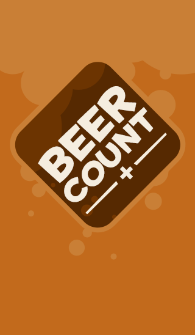
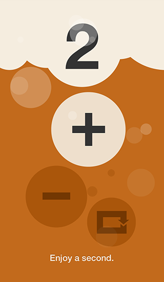

# Beer Count webapp 2.0

iOS web app built on H5BP mobile. Beer Count help's me count the number of beers I drink at social gatherings.

* git source: [https://github.com/frankyonnetti/beercount](https://github.com/frankyonnetti/beercount)
* Homepage: [http://frank.yonnetti.com/beercount](http://frank.yonnetti.com/beercount)

 . 

---

Anyone is welcome to [download](https://github.com/frankyonnetti/beercount/archive/master.zip) or clone the repo `git clone git://github.com/frankyonnetti/beercount.git`

**The MIT License (MIT)**

[README](LICENSE.md)

---

Change log - 2.0:

* Updated to latest version of H5BP-mobile
* Updated to work corretly on iOS 7
* Added landscape view
* Redesigned the buttons to act/appear more like beer bubbles

---

**Open sourced software used:**

H5BP-mobile: [http://mobileboilerplate.com](http://mobileboilerplate.com)
